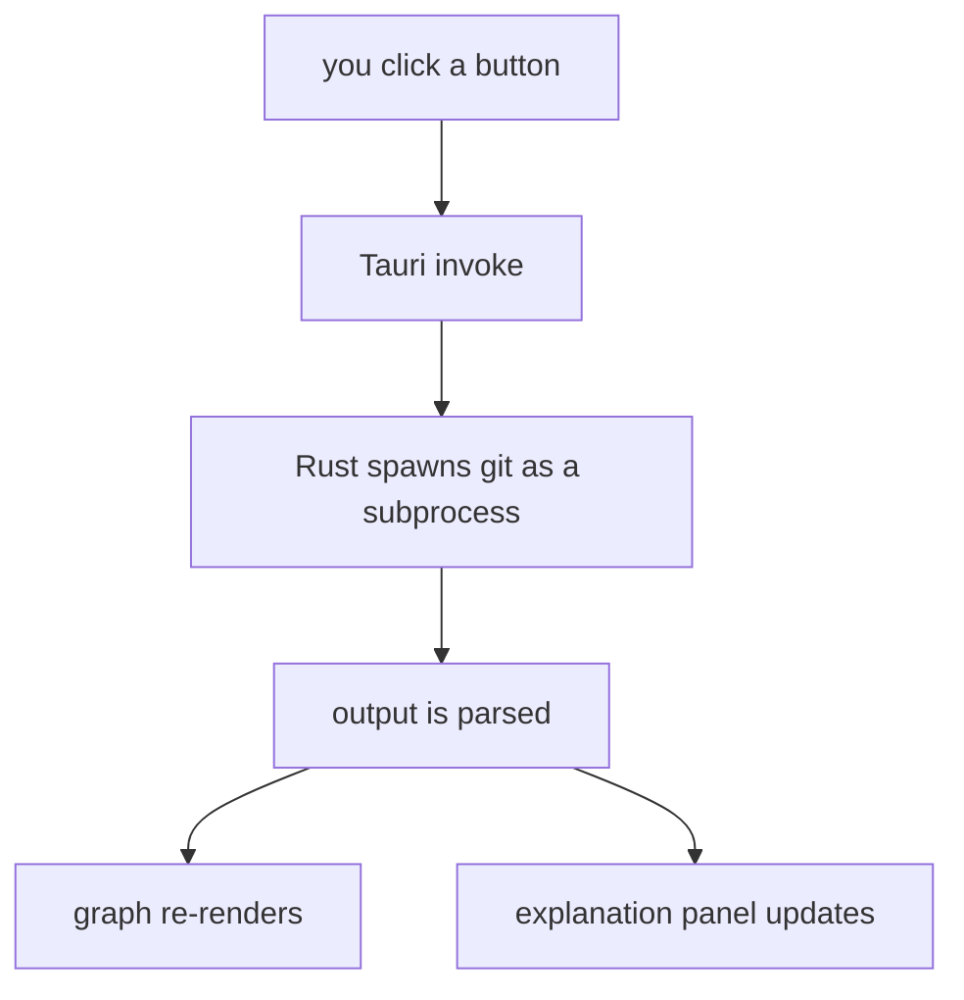

# GitRoot — design document (v1)

## 1. What is this project

A desktop app that opens a local git repository and lets you run common git
operations from buttons instead of the command line — while showing you,
in plain language, what each operation actually did. The goal isn't just
"buttons instead of typing" (existing tools already do that) — it's that
using the app should leave you understanding git a little better each
time, not just clicking blindly.

**v1 scope:** this document covers the core app — opening a repo, running
commands from buttons, seeing an interactive commit graph, and getting a
plain-language explanation after each action. No AI assistant yet —
natural language commands are v2 (see [section 4](#4-scope)).

## 2. How it works

### 2.1 Getting started

1. Launch the app. If `git` isn't found on the system, a friendly screen
   explains this and points to install instructions, rather than
   failing later with a confusing error. This matters more than it
   might seem — the target audience is git beginners, and on Windows
   specifically, git isn't pre-installed the way it often is on macOS
   or Linux.
2. A folder picker opens — you select your project's folder.
3. The app checks it's a valid git repository (looks for a `.git`
   directory / runs `git rev-parse --is-inside-work-tree`).
4. If valid, the main screen loads with that repo's data. If not, a
   friendly message explains why, with an option to initialize a new repo
   there instead.

### 2.2 Layout

Two panels, side by side.

```
┌────────────────────────────────────────────────────┐
│  my-app                                    [ sync ] │
├────────────────┬─────────────────────────────────────┤
│  commands       │  history                            │
│                 │                                      │
│  [ pull ]       │   ●  add login validation             │
│  [ push ]       │   │  a3f21c9 · 2h ago                  │
│  [ commit ]     │   ●  fix navbar spacing                │
│  [ stash ]      │   │  9e7b2a1 · yesterday                │
│  [ merge ]      │   ●  initial commit                     │
│  [ branch ]     │                                       │
│  [ reset ]      │  ───────────────────────────────    │
│                 │  what happened                       │
│                 │  "pushed 2 commits to origin/main.    │
│                 │   no conflicts."                      │
└────────────────┴─────────────────────────────────────┘
```

- **Left — commands**, grouped by what they actually do, and
  contextually dimmed when they don't apply right now (nothing to push?
  push is disabled, not hidden) — this keeps the full vocabulary visible
  for learning, while visual noise self-prunes based on the repo's
  actual state:

  **Sync** — pull, push, fetch

  **Save work** — commit, stash, amend last commit

  **Branches** — switch/create branch, merge, delete branch

  **Undo** — stash pop, reset *(risky)*, revert, discard changes
  *(risky)*, clean untracked files *(risky)*

  Every one runs a specific, known operation — no free-text command
  entry in v1. Rebase is deliberately v2 — see [section 4](#4-scope).
- **Right — graph and explanation.** The top of the panel is the commit
  graph. The bottom is a running explanation of what your last action
  did.

### 2.3 The commit graph

- Each commit is a node; branches are visually distinct lines.
- The graph updates and animates when the repo state changes (a new
  commit slides in, a merge visibly joins two lines) rather than just
  redrawing instantly — this is what makes it feel alive and worth
  watching, not just a static log.
- Clicking a commit can show its details (files changed, full message) —
  a reasonable v1 stretch goal if time allows.

### 2.4 The "what happened" panel

After you click a button, this panel explains the result in plain
language — not the raw git output. Two tiers, and this is a deliberate
split:

- **Most commands** (pull, push, commit, stash, merge with no
  conflicts): run immediately, then explain the result. E.g. "pulled 3
  commits from origin/main" or "stashed 2 changed files."
- **Risky commands** (`reset --hard`, force push, deleting a branch with
  unmerged commits): show a confirmation step *before* running — "this
  will permanently discard your last 2 commits, they can't be recovered
  through the app. continue?" This is the one exception to "explain
  after": for anything that can lose work, the explanation has to come
  first, with a real confirm step.
- **Operations that can pause** (merge, if it hits a conflict): confirm
  before starting, like risky commands, but can also stop mid-way with a
  clear message and **continue** / **abort** buttons. Resolving the
  actual conflict happens in your editor or terminal in v1 — the app
  hands off cleanly rather than blocking on conflict-resolution UI that
  doesn't exist yet.

The explanations come from a JSON dictionary, owned by the frontend —
deliberately not Rust. Rust's job stops at "ran this operation, here's
the exit code and output"; wording, tone, and eventually translations
are a presentation concern that shouldn't need a Rust recompile to
change. The same object also carries the risky/safe flag, so it's one
source of truth for both the explanation and whether to confirm first:

```json
{
  "git stash": {
    "explanation": "saved your uncommitted changes so you can switch branches cleanly. get them back with stash pop.",
    "risky": false
  },
  "git reset --hard": {
    "explanation": "throws away all uncommitted changes and moves your branch back to the chosen commit.",
    "risky": true,
    "confirmText": "this can't be recovered through the app. continue?"
  },
  "git merge <branch>": {
    "explanation": "combines <branch>'s history into your current branch.",
    "risky": false
  }
}
```

No AI involved in v1 — this is a static, fast, offline lookup.

### 2.5 Under the hood



- **Shell**: Tauri — the UI (webview) can't touch the file system or run
  processes directly (browser sandbox), so every button click asks the
  Rust side to actually do the work, over Tauri's local `invoke` bridge.
  No network involved, no server to host — it's one app, one install.
- **Running commands**: Rust builds each git command as a list of
  arguments (`Command::new("git").arg("merge").arg(branch_name)`), never
  as a concatenated string — this avoids shell injection entirely, and
  guarantees the command shown to you is exactly the command that ran.
- **Reading data for the graph**: either `git log` with a stable,
  script-friendly output format (`--pretty=format:...`, `--porcelain`
  for status), or the `git2` crate (Rust bindings for libgit2) if
  repeated process-spawning turns out to be slow on large repos.

### 2.6 Merge and rebase, in detail

Both are more involved than the other commands, so they get their own
design pass rather than a one-line dictionary entry.

**Merge**

Before running anything, use `git merge-tree` (a plumbing command that
performs a trial merge without touching the working directory or index)
to know in advance which of three outcomes is coming:

- **Fast-forward** — no new commits on the current branch since it
  diverged, so this just moves the branch pointer. No new merge commit.
  "this will fast-forward main to include feature-login's 3 commits."
- **Clean merge** — both sides diverged, but git can combine them
  automatically. "this will merge feature-login into main, 3 commits,
  no conflicts."
- **Would conflict** — name the specific files. "this will merge
  feature-login into main, but auth.js and config.json conflict —
  you'll need to resolve them."

After: explain the result if clean/fast-forward. If it conflicts, pause
— same pattern as everything else — naming exactly which files.

**Rebase**

The single most important safety check, and it has to happen *before*
any preview: compare the commits about to be rebased against the
remote tracking branch (`origin/<branch>`). If any of them already
exist there — meaning they've been pushed — show a strong warning:
"some of these commits are already on your remote. rebasing rewrites
their history, which can cause real problems for anyone who's already
pulled them. continue?" This matters more than conflict handling —
it's about protecting other people's work, not just the user's own.

After that check, preview the plan ("this will replay 4 commits from
feature-x onto main, one at a time, giving them new commit hashes"),
then execute while tracking progress, since rebase happens commit by
commit ("resolving commit 2 of 4"). A conflict mid-way pauses exactly
like a merge conflict, but also shows which commit in the sequence
you're on. Abort must always be one click away — `git rebase --abort`
is the actual safety net here, more than any UI copy.

**Honest asymmetry between the two:** merge's preview is reliable —
`merge-tree` gives a real answer before anything runs. Rebase's
preview can't promise the same, since each commit's outcome can depend
on how the previous one was resolved. It's a statement of intent, not
a guarantee.

**Scope stays the same either way:** just "rebase current branch onto
target." No interactive rebase — no squashing, reordering, or editing
commits. That line is what keeps this safe to expose at all; full
interactive rebase remains v2 regardless of when this ships.

Both operations share the same pause/conflict UI — build it once as a
shared component rather than duplicating it for merge and rebase
separately.

## 3. Tech stack

| Layer | Choice |
|---|---|
| Shell | Tauri (Rust + system webview) |
| Git operations | `git` CLI via subprocess (argument arrays) |
| Graph data reads | `git log` / `git2` crate |
| Frontend | React inside the Tauri webview |
| Graph animation | Framer Motion (`layout` + `AnimatePresence`) |
| Command explanations | JSON dictionary, owned by the frontend |

## 4. Scope

### Build first — prove the core loop
Before the full command panel, before every group is wired up: open a
repo, render the commit graph (read-only), and support the four
commands people reach for constantly — pull, push, commit, stash — with
the explanation panel working for just those. The graph is the real
technical risk here (laying out a DAG with merges, without lines
overlapping, is a genuine algorithmic challenge) — worth proving early
rather than discovering it's hard after everything else is built.
Commit gets real UI here too: a file list with checkboxes for staging,
explained as you go rather than hidden. Auth failures on push/pull show
a simple "you're not logged in" message, not git's raw error.

### v1 (full first release)
- Open a local repo
- Two-panel layout: commands on the left, graph + explanation on the right
- Commands grouped by concept (sync, save work, branches, undo),
  contextually dimmed rather than hidden
- Animated, readable commit graph
- Plain-language "what happened" panel, dictionary-based
- Confirm-before-execute for destructive operations; pause/continue/abort
  for merge conflicts
- Staging UI — how you choose what goes into a commit (see open
  questions; this blocks building "commit" at all)
- Graceful error messages when push/pull fails from auth — relies on
  the user's existing git credentials, no credential-management UI
  needed

### v2 (later)
- Rebase, including the interactive version (squash, reorder, edit
  commits)
- AI assistant: natural language → proposed command, still gated by the
  same confirm-before-execute panel (never auto-executes)
- AI fallback for explanations the static dictionary doesn't cover
- Recovery wizard ("I think I broke something" → searches reflog)
- Practice sandbox for trying risky operations on a throwaway copy
- Human-readable conflict resolution view
- Classroom mode for bootcamps/courses

## 5. Open questions
- [ ] Write the actual dictionary entries for all commands — draft pass
      needed, current examples are placeholders
- [ ] Icon set for the command buttons
- [ ] Does the diff view get its own panel, or live inline above the
      commit box?
- [ ] Confirm "GitRoot" isn't taken (name, package registries, domains)